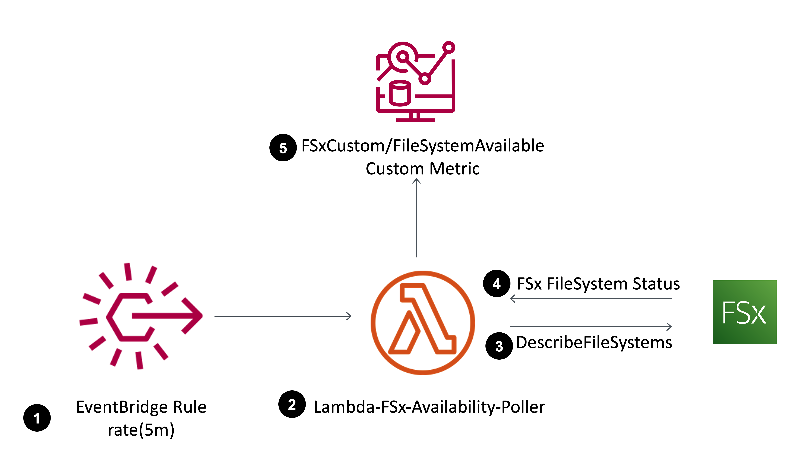

# FSx Custom Health Metrics

A CloudFormation stack that deploys a Lambda function and its necessary minimum permissions IAM policies to poll FSx file system availability status and publish it as a custom metric. Filesystems returning a value of AVAILABLE publish a metric of 1, else 0

This template will poll all available FSx filesystems in the region where it is deployed every 5 minutes and publish a custom metric to CloudWatch. Deploy the fsx-custom-health-metrics.yml template and metrics will populate in the FSXCustom/* namespace.

## Architecture:

## Security

See [CONTRIBUTING](CONTRIBUTING.md#security-issue-notifications) for more information.

## License

This library is licensed under the MIT-0 License. See the LICENSE file.

